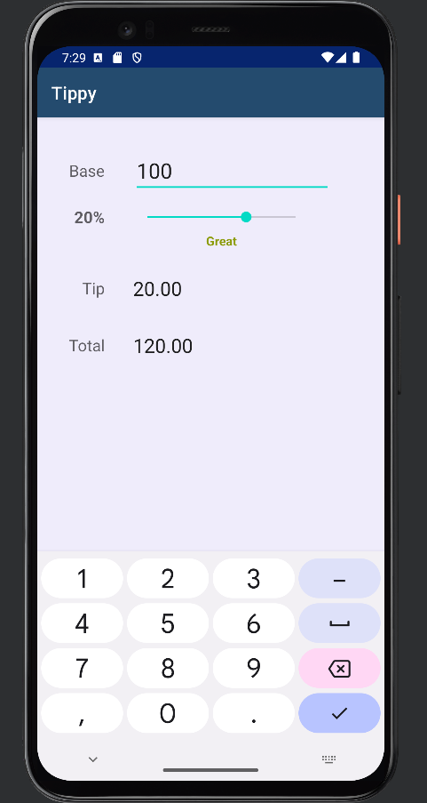
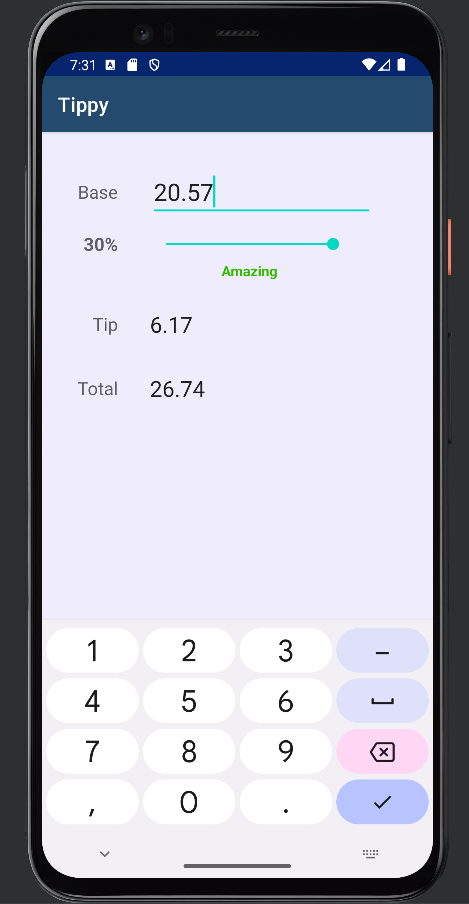

# Tippy Android Kotlin App

The following Android app allows to calculate the tip amount on total bill and gives a grade Poor to Amazing based on entered amount

Technologies used: **Android**, **Kotlin**

_Example #1:_

_Example #2:_

